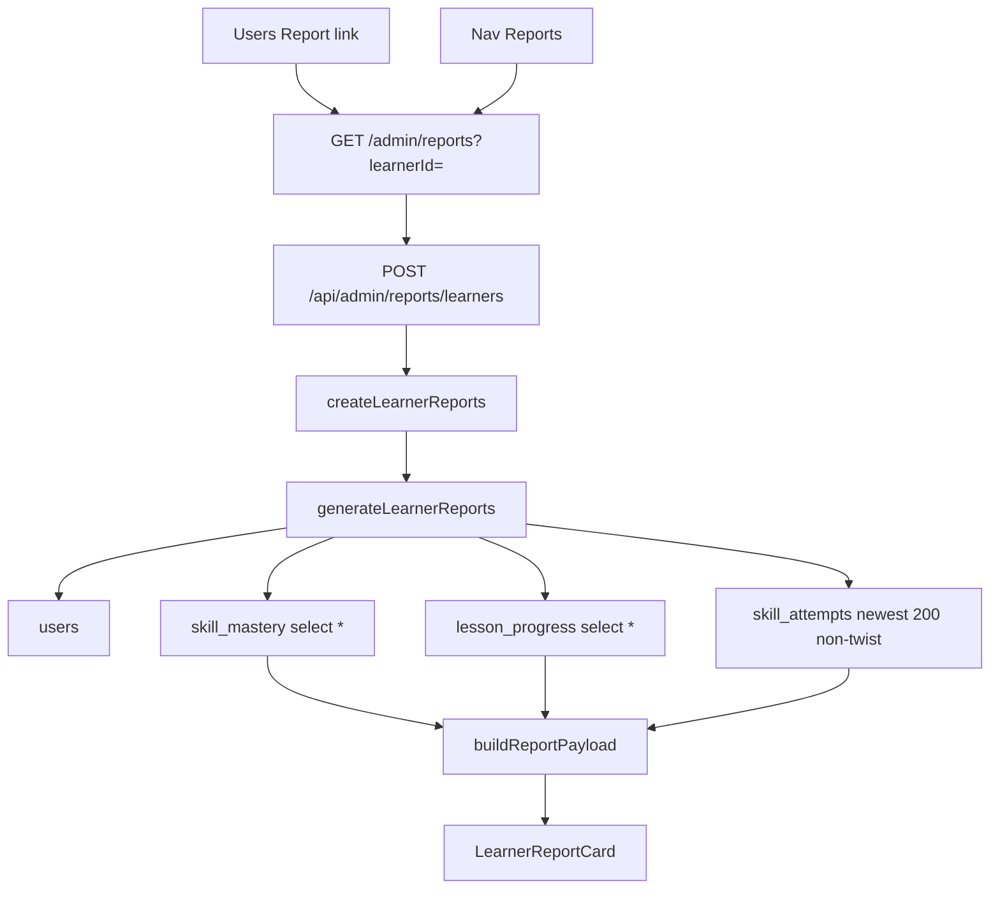
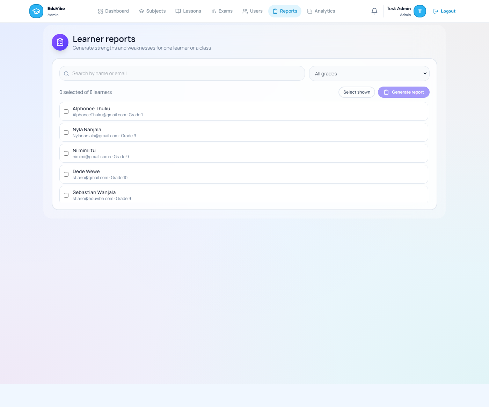
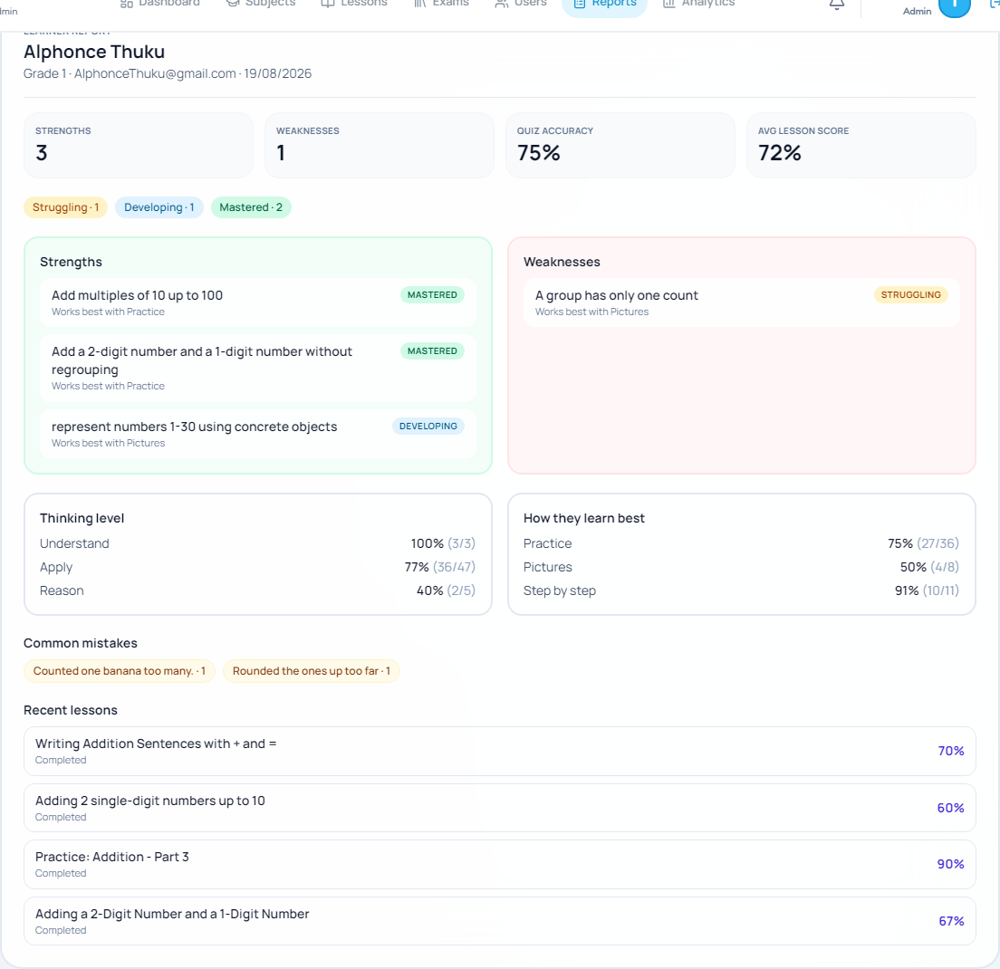
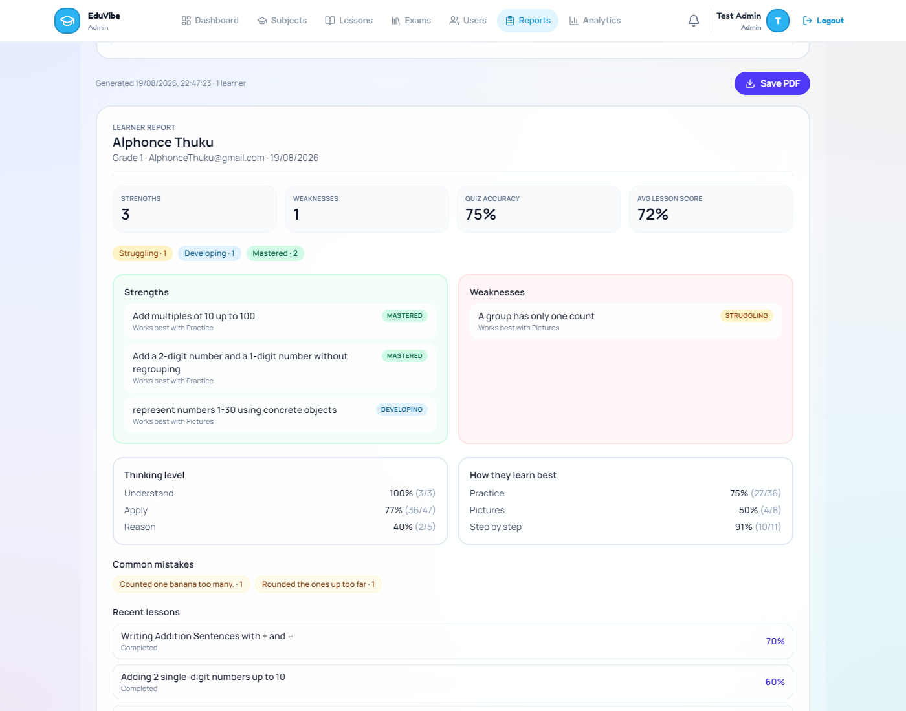
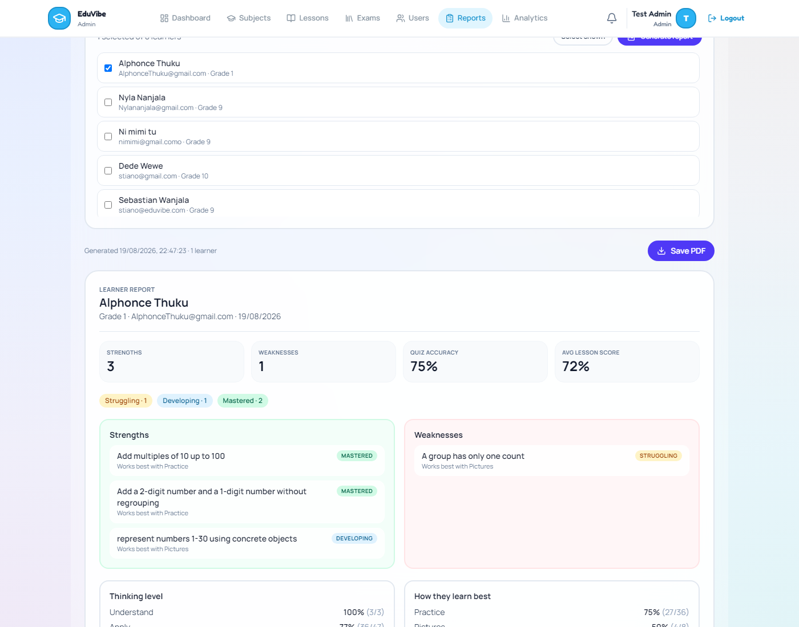

# Admin per-learner report audit

**Date:** 2026-08-19  
**Scope:** How an admin report for one learner is generated and presented today. Discovery only. No redesign.  
**Live case:** Alphonce Thuku, Grade 1, `users.id = d0b9f845-55b3-4f4f-95d4-ed039e0a2acd`  
**Live POST:** 2026-08-19T19:47:23.911Z — raw JSON at [`measurements/admin-learner-report-alphonce.json`](measurements/admin-learner-report-alphonce.json)

There is no separate admin learner-profile page. The only per-learner report UI is `/admin/reports`. Analytics (`/admin/analytics`) is platform counts, not this path.

---

## PART A: How a per-learner report is actually generated

### A1. Real path

Admin reaches the screen from:

- Top nav **Reports**, description `"Learner strengths and weaknesses"` ([`frontend/src/config/adminNav.ts`](../frontend/src/config/adminNav.ts) lines 57–60)
- Dashboard card **Reports** / `"Strengths and weaknesses"`
- Users header `"Learner reports"` → `/admin/reports`
- Users row `"Report"` → `/admin/reports?learnerId={id}` (auto-POSTs once)

All admin report routes sit behind `authenticate` + `requireRole('admin')`:

```21:37:backend/admin/routes/index.js
router.use(authenticate, requireRole('admin'));
// ...
router.use('/reports', learnerReportRoutes);
```

The only endpoints:

```1:7:backend/admin/routes/learnerReport.js
import express from 'express';
import { createLearnerReports, getLearnerReport } from '../controllers/learnerReportController.js';

const router = express.Router();

router.post('/learners', createLearnerReports);
router.get('/learners/:userId', getLearnerReport);
```

Effective URLs:

- `POST /api/admin/reports/learners` with `{ userIds }` — **this is what the admin UI calls**
- `GET /api/admin/reports/learners/:userId` — defined; **`api.admin.getLearnerReport` is never called** from the frontend

Controller (no extra math, no cache):

```9:26:backend/admin/controllers/learnerReportController.js
export const createLearnerReports = async (req, res) => {
  try {
    const userIds = Array.isArray(req.body?.userIds) ? req.body.userIds : [];
    const payload = await generateLearnerReports(userIds);
    res.json(payload);
  } catch (error) {
    sendError(res, error, 'Failed to generate learner reports');
  }
};

export const getLearnerReport = async (req, res) => {
  try {
    const report = await generateLearnerReport(req.params.userId);
    res.json(report);
  } catch (error) {
    sendError(res, error, 'Failed to generate learner report');
  }
};
```

The admin page POSTs and stores the JSON as-is:

```91:106:frontend/src/pages/admin/LearnerReports.tsx
  const generate = async (ids = [...selectedIds]) => {
    if (!ids.length) {
      setGenerateError('Select at least one learner')
      return
    }
    try {
      setGenerating(true)
      setGenerateError('')
      const data = (await api.admin.generateLearnerReports(ids)) as {
        generatedAt: string
        reports: LearnerReport[]
        classInsights: ClassInsights | null
      }
      setReports(data.reports || [])
      setInsights(data.classInsights || null)
      setGeneratedAt(data.generatedAt || new Date().toISOString())
```

`generateLearnerReports` is the real query + compute step. Four reads, then in-memory `buildReportPayload`:

```81:114:backend/admin/services/learnerReportService.js
  const learnerIds = learners.map((user) => user.id);
  const [masteryRows, progressRows, attempts] = await Promise.all([
    SkillMastery.findByUserIds(learnerIds),
    fetchProgressByUserIds(learnerIds),
    SkillAttempt.listByUserIds(learnerIds, { limitPerUser: 200 })
  ]);

  const titleById = await Lesson.findTitlesByIds(
    progressRows.map((row) => row.lesson_id).filter(Boolean)
  );
  // ...
  const reports = learners.map((learner) =>
    buildReportPayload({
      learner: publicLearner(learner),
      masteryRows: masteryByUser.get(learner.id) || [],
      progressRows: progressByUser.get(learner.id) || [],
      attempts: attemptsByUser.get(learner.id) || [],
      titleById,
      generatedAt
    })
  );

  return {
    generatedAt,
    reports,
    classInsights: reports.length > 1 ? buildClassInsights(reports) : null
  };
```

The three data queries:

```43:46:backend/admin/services/learnerReportService.js
      .from('lesson_progress')
      .select('*')
      .in('user_id', ids)
      .order('updated_at', { ascending: false });
```

```203:209:backend/models/SkillAttempt.js
      let { data: chunk, error } = await db
        .from(this.tableName)
        .select('*')
        .in('user_id', slice)
        .or('twin_role.is.null,twin_role.neq.twist')
        .order('created_at', { ascending: false })
        .limit(cap);
```

`SkillMastery.findByUserIds` is `skill_mastery` `select *` for those user ids. Twists are excluded at SQL (`twin_role` is null or not `twist`) and skipped again in `summarizeAttempts`. Cap is `limitPerUser: 200` (global cap 8000).

Same `generateLearnerReport` also feeds `GET /api/learner/progress-report` for the learner dashboard. That is a different screen. This audit is the admin card.



### A2. Data sources — read vs unused

| Signal | In production DB today | Read for this report | Shown on the admin card |
|---|---|---|---|
| `skill_attempts` non-twist | yes | yes, newest ~200 | **Quiz accuracy**, Thinking level, How they learn best, Common mistakes |
| `skill_attempts` `twin_role = 'twist'` | yes | **excluded** | never |
| `skill_mastery.status` (3-of-4 heuristic) | yes | **yes — this is Strengths / Weaknesses** | status pills only |
| `skill_mastery.bkt_p_know` | yes | mapped to `bktPKnow`; used only to **sort** strengths | **never rendered** |
| `skill_mastery.bkt_n_observations` / `bkt_updated_at` | yes | fetched via `select *`; **dropped** by `mapSkill` | never |
| `bkt_skill_params` | 21 rows | **not queried** | never |
| `lesson_progress` + `session_review.score` | yes | yes | **Avg lesson score** and per-lesson `%` |
| `session_review.practiceScore` | **no production row has this key** | **not read** | never |
| `session_review.twinPairs` | yes (Alphonce: 17 pairs) | **not read** | never |
| `session_review.answered` / `retryCount` | yes | **not read** (only `score.percentage`) | never |
| `misconception_key` | sparse | tallied, top 8 | **Common mistakes** if any |
| `prerequisite_remediation_events` | 1 row (other learner) | **not queried** | never |
| `prerequisite_edges` | 1932 rows | **not queried** | never (separate Curriculum queue) |
| `response_time_ms` | all 72 Alphonce attempts | **not used** | never |
| `adaptive_modality_signal_log` | 66 rows | **not queried** | never |

Heuristic status is the classifier. BKT is a sibling column that this upsert is written **not** to change:

```4:5:backend/admin/services/learnerReportMath.js
export const STRENGTH_STATUSES = ['mastered', 'developing'];
export const WEAKNESS_STATUSES = ['struggling', 'scaffolding'];
```

```393:437:backend/models/SkillAttempt.js
  /**
   * Mastered requires ≥3 of the most recent 4 attempts correct (not 2-in-a-row).
   * Fail side unchanged: struggling (<2 consecutive fails) / scaffolding (≥2).
   */
  static async upsertFromAttempt({
    // ...
      // Preserve BKT columns — this upsert is the 3-of-4 heuristic only (Part 5.4).
      bkt_p_know: existing?.bktPKnow ?? null,
```

`bktPKnow` is copied into the JSON and used only as a tie-break when sorting strengths:

```24:58:backend/admin/services/learnerReportMath.js
export const mapSkill = (row) => ({
  skillFocus: row.skillFocus || row.learningOutcomeKey || 'Skill',
  learningOutcomeKey: row.learningOutcomeKey,
  status: row.status || 'unknown',
  bktPKnow: row.bktPKnow == null ? null : Number(row.bktPKnow),
  preferredModality: row.preferredModalityObserved || null,
  consecutiveFailsAtLevel: row.consecutiveFailsAtLevel ?? 0,
  updatedAt: row.updatedAt || null
});
  // ...
    return (b.bktPKnow ?? 0) - (a.bktPKnow ?? 0);
```

`mapSkill` does not include `bktNObservations`. The admin type has `bktPKnow` and the card never paints it.

Lesson scores read **only** first-try `session_review.score`:

```118:131:backend/admin/services/learnerReportMath.js
export const mapLessonProgress = (rows = [], titleById = new Map()) =>
  (rows || []).map((row) => ({
    lessonId: row.lesson_id || row.lessonId,
    title: titleById.get(row.lesson_id || row.lessonId) || 'Lesson',
    progress: row.progress ?? 0,
    completed: lessonIsDone(row),
    fullyCompleted: lessonIsFullyCompleted(row),
    // ...
    scorePercentage:
      row.session_review?.score?.percentage ?? row.sessionReview?.score?.percentage ?? null,
```

Current quiz-complete code **does** compute Practice Score and twin pairs into the same JSONB blob. The report ignores both. Production `lesson_progress` for every learner was queried on 2026-08-19: **zero rows have a `practiceScore` key**. Alphonce’s four reviews have keys `score`, `answered`, `twinPairs`, `completedAt`, `modalitySignals` only.

```1053:1065:backend/learner/services/adaptiveQuizService.js
  const finalScore = firstTryScore(session);
  const practiceScore = computePracticeScore(session, lesson);

  const reviewPayload = done
    ? {
        answered: session.answered,
        score: finalScore,
        // Display-only sibling — never written to lesson_progress.progress
        practiceScore,
        modalitySignals: session.modalitySignalLog || [],
        twinPairs: session.twinPairs || [],
        completedAt: new Date().toISOString()
      }
```

```669:675:backend/learner/services/adaptiveQuizService.js
/** First-try (main phase) score only — retries excluded from percentage (Option C). */
const firstTryScore = (session) => {
  const total = session.mainScoreTotal || 0;
  const correct = session.mainScoreCorrect || 0;
  const percentage = total > 0 ? Math.round((correct / total) * 100) : 0;
```

`lesson_progress.progress` is that same first-try percentage:

```596:598:backend/learner/controllers/adaptiveController.js
      const pct = result.review.score?.percentage ?? 0; // first-try only; practiceScore stays in session_review
      const passing = Math.max(lesson.quiz?.passingScore || 60, 60);
      const completed = pct >= passing;
```

### A3. Fresh vs cached

There is no `learner_reports` table and no report snapshot. Each Generate click sets `generatedAt = new Date().toISOString()` and recomputes aggregates from the rows just fetched.

What is **not** recomputed at report time:

- `skill_mastery.status` — last 3-of-4 heuristic write
- `bkt_p_know` — last BKT replay write
- `session_review` — last finished quiz for that lesson (overwritten on a later finish)

Accuracy / Bloom / modality / misconceptions are fresh from the attempt window. That window is capped at ~200 non-twist rows and **includes retries**. It is not first-try-only and it is not full history if a learner exceeds the cap.

---

## PART B: How it is presented

### B1. The real admin screens

Picker (no learner selected yet):



Exact copy on that screen:

- Title `"Learner reports"`
- Subtitle `"Generate strengths and weaknesses for one learner or a class"`
- Placeholder `"Search by name or email"`
- `"All grades"`
- `"0 selected of 8 learners"`
- `"Select shown"` / `"Generate report"`

One-learner deep link auto-generates. Live Alphonce card, 2026-08-19 22:47:







Full page: [`measurements/admin-learner-report-alphonce-full.png`](measurements/admin-learner-report-alphonce-full.png)

Banner copy from the live shot: `"Generated 19/08/2026, 22:47:23 · 1 learner"` and `"Save PDF"`.

Card copy, quoted:

- Kicker `"Learner report"`
- `"Alphonce Thuku"`
- `"Grade 1 · AlphonceThuku@gmail.com · 19/08/2026"`
- Tiles `"Strengths"` `3`, `"Weaknesses"` `1`, `"Quiz accuracy"` `75%`, `"Avg lesson score"` `72%`
- Chips `"Struggling · 1"` `"Developing · 1"` `"Mastered · 2"`
- Lists `"Strengths"` / `"Weaknesses"` with empty strings `"No mastered or developing skills yet."` / `"No struggling skills right now."` (not hit on this learner)
- `"Works best with Practice"` / `"Works best with Pictures"`
- `"Thinking level"` / `"How they learn best"` / `"Common mistakes"` / `"Recent lessons"`
- Lesson status `"Completed"` plus a `%`

The four tiles are a direct map. No client-side recompute except Bloom/modality `rateLabel`:

```83:94:frontend/src/components/admin/LearnerReportCard.tsx
      <div className="grid grid-cols-2 sm:grid-cols-4 gap-3 mb-5">
        {[
          { label: 'Strengths', value: String(report.summary.strengthsCount) },
          { label: 'Weaknesses', value: String(report.summary.weaknessesCount) },
          {
            label: 'Quiz accuracy',
            value: report.summary.accuracyPercent != null ? `${report.summary.accuracyPercent}%` : '—',
          },
          {
            label: 'Avg lesson score',
            value: report.summary.averageScore != null ? `${report.summary.averageScore}%` : '—',
          },
```

Present in the live JSON and **not painted:** `lessonsTracked`, `completed`, `inProgress`, `skillsTracked`, `attemptCount`, `bktPKnow`, `consecutiveFailsAtLevel`, `fullyCompleted`, `scoreCorrect` / `scoreTotal`, `skillsNeedingPractice`.

`skillsNeedingPractice` is a slice of `weaknesses`. The learner dashboard uses it. This admin card does not.

There are no TODOs in the admin report UI files about wrong or stale numbers.

### B2. "The numbers part" — specific mismatches

These are wrong or unlabeled, not a taste issue.

**Mismatch 1 — two percentages that do not measure the same thing, unlabeled.**

Live tiles: **Quiz accuracy 75%** and **Avg lesson score 72%**.

| Number on screen | Code | Alphonce underlying |
|---|---|---|
| Quiz accuracy **75%** | `summarizeAttempts`: all non-twist `skill_attempts`, retries included, twists skipped. `Math.round(41/55*100)` | 41 correct / 55 attempts |
| Avg lesson score **72%** | mean of latest `session_review.score.percentage` | (70+60+90+67)/4 = 71.75 → 72 |
| First-try pooled (not shown) | `score.correct/total` on those four latest sessions | **30/42 = 71%** |
| Retry pooled (not shown) | `answered` phase `retry` | **10/12 correct** |

Retries inflate Quiz accuracy relative to first-try lesson scores. The card never says so.

**Mismatch 2 — lesson % is first-try. Practice Score is neither stored nor read.**

Shown on **"Adding 2 single-digit numbers up to 10"**: **Completed** **60%**.

That 60% is `score.percentage` = 6/10 first-try. The same `session_review.answered` has 4 retries, 3 later correct. Using the Practice Score tiers in [`backend/utils/practiceScore.js`](../backend/utils/practiceScore.js) (`FIRST_TRY=1`, `RETRY=0.5`, `MISS=0`) and treating the three recovered retries as retry-credit (no near-miss check possible without replaying question params):

**(6×1 + 3×0.5 + 1×0) / 10 = 75%**. The admin card shows **60%**.

Same for **"Writing Addition Sentences with + and ="**: shown **70%** (7/10 first-try, 3/3 retries later correct) → implied Practice Score **85%**.

Zero production `lesson_progress` rows contain `practiceScore`. Even if the current writer had persisted it, `mapLessonProgress` would still ignore it.

**Mismatch 3 — "Completed" at 60% while the database says not completed.**

Same lesson, live DB row: `progress=60`, `completed=false`, `completed_at=null`.

Report JSON: `"completed": true`, `"fullyCompleted": false`, `"scorePercentage": 60`.

The UI prints `"Completed"` and `60%` because `completed` on the payload is `lessonIsDone`, not the column:

```12:25:backend/utils/lessonUnlock.js
export const progressMeetsUnlock = (progress) => {
  if (!progress) return false;
  return progress.completed === true || Number(progress.progress) >= LESSON_PASS_THRESHOLD;
};
export const lessonIsDone = progressMeetsUnlock;
export const lessonIsFullyCompleted = (progress) =>
  !!progress && progress.completed === true;
```

`LESSON_PASS_THRESHOLD` is 60. So a lesson that failed the `completed` column still shows as Completed. The verify script locks this in: `"65% counts as done even when completed is false"`. `fullyCompleted` is in the JSON and discarded by the card.

Live JSON for that row:

```137:147:docs/measurements/admin-learner-report-alphonce.json
          "title": "Adding 2 single-digit numbers up to 10",
          "progress": 60,
          "completed": true,
          "fullyCompleted": false,
          "completedAt": null,
          "scorePercentage": 60,
          "scoreCorrect": 6,
          "scoreTotal": 10
```

**Mismatch 4 — Strengths / Weaknesses are the heuristic, not BKT. BKT is in the payload and hidden.**

Live strengths include `"represent numbers 1-30 using concrete objects"` with pill **DEVELOPING**. `STRENGTH_STATUSES` includes `developing`, so one heuristic tick is a Strength.

That row’s stored BKT is `bkt_p_know = 0.760975609756098`, `bkt_n_observations = 1`. The card does not show either number.

Worse: **there are zero `skill_attempts` rows** for that `learning_outcome_key` (`f0ee410529a15b33`) in the whole database. Same for the Weakness `"A group has only one count"` (`de83fac6a9c29179`) — status `struggling`, BKT 0.336, n=1, **no attempts**. The report still counts them as Strength 3 and Weakness 1.

**Mismatch 5 — "Works best with Practice" contradicts the modality table on the same card.**

`preferred_modality_observed` is overwritten to the last successful non-mixed modality (`upsertFromAttempt` lines 417–418). It is not the highest accuracy modality.

Live card:

- Strengths: `"Works best with Practice"` on both mastered skills
- **"How they learn best"**: Step by step **91% (10/11)**, Practice **75% (27/36)**, Pictures **50% (4/8)**

The heading says best. The list says Practice. The table says Step by step.

**Mismatch 6 — twin consistency is stored and dropped from the accuracy denominator.**

Alphonce: 72 attempts, 17 twists, 17 `twinPairs` in `session_review`. Report accuracy uses 55 non-twist rows. Pair outcomes in the DB include `fast_correct` original-true / twist-false (guessing signal) and `incorrect` original-false / twist-true. None of that is on the card.

**Mismatch 7 — Common mistakes are shown, and they are thin.**

Live chips: `"Counted one banana too many. · 1"` and `"Rounded the ones up too far · 1"`. 2 of 14 incorrect non-twist attempts are tagged. Raw `misconception_key` strings, not a pattern summary.

### B3. BKT, Practice Score, misconceptions in the admin view today

| Signal | On the admin report today |
|---|---|
| BKT confidence | **No.** In JSON as `bktPKnow`. Not rendered. Observation count not even in JSON. |
| Practice Score | **No.** Not in production `session_review`. Not read if it were. Learner G1–3 UI will use it only when `review.practiceScore.percentage != null`; that key is absent, so the child path also falls back to first-try for these stored sessions. |
| Misconception patterns | **Yes, barely.** `"Common mistakes"` chips of keys × count. |

---

## PART C: What exists in the data and is not surfaced

Real, queryable signal that this report does not show:

- **BKT p(Know) and observation count per skill.** Alphonce mastered rows are ~1.0 (n=13 and n=42). The orphan Developing/Struggling rows are n=1 with no matching attempts. [`backend/scripts/verify-bkt-lite.js`](../backend/scripts/verify-bkt-lite.js) already has a `disagreement(status, pKnow, n)` helper. The report does not call it.
- **Practice Score vs first-try, side by side.** Recomputable from `session_review.answered` even though `practiceScore` was never persisted. Concrete gaps above: 60% vs ~75%, 70% vs ~85%.
- **Misconception frequency beyond two one-off keys.** 12 of 14 incorrect non-twist attempts have no tag.
- **Prerequisite routing / "did remediation help".** Table `prerequisite_remediation_events` has one row, for learner **Ni mimi tu** (`ba6d6509-…`), `learning_outcome_key = d02489793ffb01e2`, `followup_correct=true`, `improved=true`, `routed_lesson_id=null`. Not queried here. Alphonce has no row.
- **Twin-consistency (guessing vs understanding).** 17 pairs on Alphonce, including split pairs. Stored on attempts (`twin_pair_id`, `twin_role`, `twin_trigger_reason`) and on `session_review.twinPairs`. Excluded from accuracy, never summarized.
- **Session pacing.** All 72 Alphonce attempts have `response_time_ms` (median 5004 ms, mean 8429 ms). Unused.
- **Retry vs first-try split.** Already on `score.retryCount` and `answered[].phase`. Unused. Alphonce latest sessions: mains 30/42, retries 10/12.
- **`fullyCompleted` vs lenient `completed`.** Computed, then ignored. That is why 60% with `completed=false` prints as Completed.
- **Outcome-key vs skill label drift.** Attempts under `d02489793ffb01e2` use six different `skill_focus` strings (including `"Addition"`, `"Add two single-digit numbers up to 10"`, `"Model addition as putting objects together"`). The report shows only the mastery row’s label `"Add multiples of 10 up to 100"`.
- **`adaptive_modality_signal_log`.** 66 rows. Not queried.

---

## PART D: Side by side — Alphonce Thuku, Grade 1

Live generate 2026-08-19T19:47:23.911Z. 72 `skill_attempts`, 4 `skill_mastery`, 4 `lesson_progress`.

### What the admin report displayed

From the live card and the POST body:

| Shown | Value |
|---|---|
| Strengths | **3** |
| Weaknesses | **1** |
| Quiz accuracy | **75%** |
| Avg lesson score | **72%** |
| Status chips | Struggling · 1, Developing · 1, Mastered · 2 |
| Strength: Add multiples of 10 up to 100 | MASTERED · Works best with Practice |
| Strength: Add a 2-digit number and a 1-digit number without regrouping | MASTERED · Works best with Practice |
| Strength: represent numbers 1-30 using concrete objects | DEVELOPING · Works best with Pictures |
| Weakness: A group has only one count | STRUGGLING · Works best with Pictures |
| Understand | 100% (3/3) |
| Apply | 77% (36/47) |
| Reason | 40% (2/5) |
| Practice / Pictures / Step by step | 75% (27/36) / 50% (4/8) / 91% (10/11) |
| Common mistakes | Counted one banana too many. · 1 ; Rounded the ones up too far · 1 |
| Writing Addition Sentences with + and = | Completed **70%** |
| Adding 2 single-digit numbers up to 10 | Completed **60%** |
| Practice: Addition - Part 3 | Completed **90%** |
| Adding a 2-Digit Number and a 1-Digit Number | Completed **67%** |

### What is in the database and not shown

| Stored | Value | On the card? |
|---|---|---|
| `bkt_p_know` Add multiples of 10 | 0.999999999 (n=42) | no |
| `bkt_p_know` 2-digit + 1-digit | 0.999996201263174 (n=13) | no |
| `bkt_p_know` represent numbers 1-30 | 0.760975609756098 (n=1) | no — and **0 matching attempts** |
| `bkt_p_know` A group has only one count | 0.335593220338983 (n=1) | no — and **0 matching attempts** |
| Non-twist attempts | 55 (41 correct) | only as 75% |
| Twist attempts | 17 | excluded |
| Twin pairs in `session_review` | 17 | no |
| First-try pooled | 30/42 = 71% | no (72% is the mean of four percents) |
| Retry pooled | 10/12 | no |
| Implied Practice Score, 60% lesson | ~75% | no; **60%** shown |
| Implied Practice Score, 70% lesson | ~85% | no; **70%** shown |
| `lesson_progress.completed` on the 60% lesson | **false** | card says Completed |
| `practiceScore` key | missing on all four reviews | — |
| `response_time_ms` | 72/72 filled, median 5.0s | no |
| Remediation events for this learner | none | — |
| `attemptCount` in JSON | 55 | not painted |

The 60% lesson is the cleanest single picture of "the numbers part": the admin is told the lesson is **Completed at 60%**, the column says it is **not** completed, first-try is 6/10, retries recovered 3 of 4 misses, twins ran 9 times, and BKT for the outcome stamped on that work is hidden while an unrelated Developing skill with **no attempts** is listed as a Strength.
