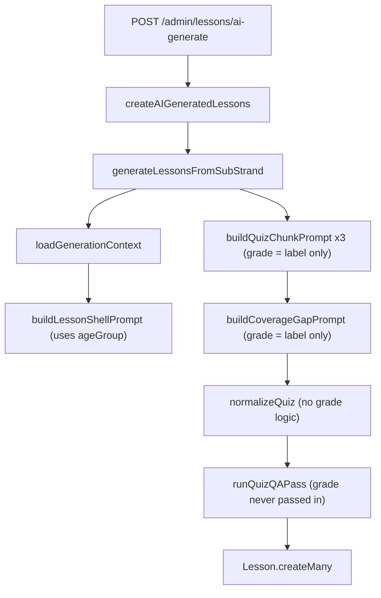

# Quiz generation and question-type full audit

**Date:** 2026-08-11
**Type:** Discovery / reporting only. No code changes were made in this pass.
**Method:** Direct file reads plus `git show` / `git diff` against a discarded commit. All quotes below are verbatim.

---

## 0. CRITICAL: the audit has to describe two different trees

Before answering anything, one fact changes the meaning of every other answer in this report.

**The Tier 2 Phase 1 work you referenced does not exist in your working tree.** It exists only in commit `9b4a3b0`, which was discarded by a `git reset` earlier today and is now orphaned — reachable through the reflog, not from `main`.

```
30b374e HEAD@{2026-08-11}: reset: moving to 30b374e
9b4a3b0 HEAD@{2026-08-10}: commit: admin redesign
30b374e HEAD@{2026-08-10}: commit: token generation fixed
```

`git status` reports `working tree clean` and `Your branch is up to date with 'origin/main'`, so this work is not sitting uncommitted anywhere on disk. `git stash list` is empty. The only copy is the orphaned commit object.

### What is in `9b4a3b0` and missing from HEAD

| Path | Lines in that commit | Present at HEAD `30b374e`? |
|---|---|---|
| `backend/utils/additionTemplate.js` | 318 | No |
| `frontend/src/components/learner/TapSelectOptions.tsx` | 72 | No |
| `backend/data/grade1-3-mathematics-curriculum.json` | 582 | No |
| `backend/scripts/seed-grade1-3-mathematics-curriculum.js` | 348 | No |
| `backend/scripts/verify-addition-twist.js` | 103 | No |
| `backend/scripts/verify-addition-phase1-e2e.js` | 129 | No |
| `backend/scripts/verify-twin-consistency.js` | 120 | No |
| `backend/scripts/verify-diagram-rendering.js` | 71 | No |
| `backend/database/migration_twin_consistency.sql` | 21 | No |
| `docs/tier2-phase1-verification.md` | 149 | No |
| `docs/copy-vs-reality-audit.md` | 343 | No |
| `docs/admin-ui-redesign-spec.md` | 75 | No |
| Raised token limits, twin serving, admin redesign, regenerated G3 dump | modifications to 20+ existing files | No |

The commit is titled "admin redesign" and mixes the Phase 1 quiz work with a large admin UI redesign (`Dashboard.tsx`, `Lessons.tsx`, `Subjects.tsx`, `Shell.tsx`, `globals.css`, etc.) — 42 files, 6,593 insertions.

### How this report handles it

Every answer below is labelled for both trees:

- **HEAD** = `30b374e`, what is actually on disk right now and what is on `origin/main`.
- **9b4a3b0** = the orphaned commit, which is what your questions assume is current.

Recovery is a one-line operation and is **not** performed in this pass: `git checkout -b recover-phase1 9b4a3b0` (or `git cherry-pick 9b4a3b0`) would restore it. Orphaned commits survive until git garbage-collects unreachable objects, so this is not indefinitely safe.

**Uncertain and not determinable from the code:** whether the reset was deliberate (e.g. to unwind the admin redesign) or accidental. If it was deliberate, the Phase 1 quiz work was collateral damage, because it was committed in the same commit as the redesign.

---

## PART A: quiz-generation prompt structure, exactly as it exists today

### A1. The three Bloom-band prompts

There is **one** prompt template, `buildQuizChunkPrompt`, called three times. It lives in `backend/admin/services/lessonGenerationService.js` at lines 819-873 at HEAD.

The three bands differ **only** by three interpolated strings, defined at lines 540-563:

```540:563:backend/admin/services/lessonGenerationService.js
/** Bloom-banded chunk specs — together they form the outcome × bloom × modality matrix. */
const QUIZ_CHUNKS = [
  {
    label: 'foundation',
    bloomFocus:
      'bloomLevel "recall" and "understand" ONLY. Foundation checks of the basic facts and meanings.',
    matrixRule:
      'For EACH outcome include at least 1 visual question and at least 1 text_steps question (with steps[]).'
  },
  {
    label: 'application',
    bloomFocus:
      'bloomLevel "apply" ONLY. Learners use the skill on new values/situations.',
    matrixRule:
      'For EACH outcome include at least 1 text_steps scaffold (steps[] showing the working) and at least 1 visual question.'
  },
  {
    label: 'reasoning',
    bloomFocus:
      'bloomLevel "reason" ONLY. Real-life reasoning, predict-the-outcome and best-choice decisions.',
    matrixRule:
      'Mostly practice modality; include at least 1 text_steps scaffold per outcome for learners who need the reasoning broken down.'
  }
];
```

#### Full prompt builder at HEAD (`30b374e`), verbatim

```819:873:backend/admin/services/lessonGenerationService.js
const buildQuizChunkPrompt = (
  ctx,
  shell,
  lessonIndex,
  totalLessons,
  chunk,
  avoidStems = [],
  quizExemplarsBlock = '',
  targetCount = CHUNK_SIZE
) => {
  const title = shell?.title || `Lesson ${lessonIndex}`;
  const objectives = (shell?.learningObjectives || ctx.sourceOutcomes.slice(0, 2))
    .map((o, i) => `${i + 1}. ${o}`)
    .join('\n');
  const { profile } = ctx;
  const diagramTypeList = profile.allowedDiagramTypes.join('|');
  const avoidBlock =
    avoidStems.length > 0
      ? `\nDo NOT repeat or lightly reword any of these existing questions (use different values, situations and wording):\n${avoidStems
          .slice(0, 30)
          .map((s) => `- ${s.slice(0, 80)}`)
          .join('\n')}\n`
      : '';
  return `Create PART "${chunk.label}" of the adaptive QUIZ BANK for Kenyan CBC lesson "${title}" (lesson ${lessonIndex} of ${totalLessons}, Grade ${ctx.grade}).

Outcomes:
${objectives}
Topic: ${ctx.subject.name} · ${ctx.strand.name} · ${ctx.subStrand.name}
Teaching summary: ${String(shell?.content || '').slice(0, 400)}

${profile.quizStyle}

THIS PART: ${chunk.bloomFocus}
${chunk.matrixRule}
${avoidBlock}${quizExemplarsBlock ? `\n${quizExemplarsBlock}\n` : ''}
Return ONLY one JSON object:
{
  "quiz": {
    "questions": [ /* EXACTLY ${targetCount} items */ ]
  }
}

COMPACT QUESTION SHAPE — include ONLY:
- question, options (3-4), correctAnswerIndex
- explanation (max 16 words)
- distractors:[{"optionIndex":number,"misconception":"max 8 words"}] for wrong options
- learningOutcomeIndex, bloomLevel, modality, difficulty
Do NOT include id, type, points, skillFocus, optionExplanations, feedbackCorrect or feedbackIncorrect; the server adds them.
Visual questions MUST include "diagram": { "diagramType": one of ${diagramTypeList}, "params":{}, "brief":"..." }.
text_steps questions MUST include steps[] (max 3 short steps).
NEVER reuse vb-1/vb-2 for quiz diagrams.
Match diagram type to topic. Diagram content must match the question exactly (same numbers, words, steps).
${profile.mathRule}
Keep every string concise. Return complete valid JSON only — do not truncate. No markdown fences.`;
};
```

#### The one difference in `9b4a3b0`

`9b4a3b0` inserts an `additionTemplateBlock` immediately before `${profile.mathRule}`. It is empty for every context except Grade 1 Mathematics Addition. Verbatim from `git diff 30b374e 9b4a3b0`:

```javascript
  const additionTemplateBlock = isGradeOneAdditionContext(ctx)
    ? `
GRADE 1 ADDITION TEMPLATE SLICE:
- For every TWO-OPERAND addition question, set template:true and include:
  questionText with both {a} and {b}; params:{a,b}; constraints; answerFormula:"a + b";
  distractorFormulas with at least 3 {id,formula,misconception} entries.
- Keep "question" and "options" rendered with the initial params for review.
- Derive constraints from the exact outcome:
  * two single digits: a:[1,9], b:[1,9], sumMax:10
  * two-digit + one-digit without regrouping: a:[10,99], b:[1,9], sumMax:100, noRegrouping:true
  * multiples of ten: a:[10,90], b:[10,90], aStep:10, bStep:10, sumMax:100
- Always include operation:"addition". Never exceed the outcome's sum limit.
- Formula results must be non-negative integers and never duplicate the correct answer or each other
  for ANY valid pair in the constraint range. Safe examples are a+b-1, a+b+1 and a+b+2.
- Three-addend and missing-pattern questions are not supported by this Phase 1 template engine:
  set template:false and omit all template-only fields for those questions.
- Include at least 4 valid template:true questions in this chunk when the selected outcomes permit it.
`
    : '';
```

#### Fourth generation call on the same path

A coverage gap-fill call runs after the three bands, `buildCoverageGapPrompt` at lines 933-963. Grade again appears only as a bare label: `Create ${count} multiple-choice quiz questions for Kenyan CBC lesson "${title}" (Grade ${ctx.grade}).`

#### Token limits

**HEAD:**

```533:538:backend/admin/services/lessonGenerationService.js
export const GENERATION_TOKEN_LIMITS = Object.freeze({
  lessonShell: 2500,
  quizChunk: 6000,
  coverageGap: 2200,
  quizQa: 1800
});
```

**`9b4a3b0`:** `quizChunk: 20000` and `quizQa: 3000`; `lessonShell` and `coverageGap` unchanged. Your recollection that token limits were raised is correct — but that raise exists only in the orphaned commit. On disk right now, the quiz chunk cap is 6000.

`docs/tier2-phase1-verification.md` in `9b4a3b0` records why: the reasoning chunk used 16,131 of a then-16,384 ceiling on a real Grade 1 Addition run, so the ceiling was raised to 20,000 for headroom.

Model: default `claude` provider, `claude-sonnet-5` (`backend/providers/claudeContentProvider.js`). No `temperature` is passed on the quiz path in either tree.

### A2. Grade-band, age-band, or reading-level logic in the quiz path

**There is none. Quiz generation has zero grade-awareness beyond a bare label in the prompt string and a grade filter on retrieval.** This is true at HEAD and true in `9b4a3b0`.

Full call path checked, not just the prompt template:



An age band **is** computed, and it is used **only** for the lesson shell, never for the quiz:

```719:728:backend/admin/services/lessonGenerationService.js
  const grade = subject.grade;
  const gradeNumber = grade === 'K' ? 0 : parseInt(grade, 10);
  const ageGroup =
    gradeNumber <= 2
      ? 'very young children (ages 5-7)'
      : gradeNumber <= 5
        ? 'young children (ages 8-10)'
        : gradeNumber <= 8
          ? 'pre-teens (ages 11-13)'
          : 'teens (ages 14+)';
```

Its only consumer is the shell prompt at line 768: `You are a Kenyan CBC tutor. Write ONE short lesson SHELL (lesson ${lessonIndex} of ${totalLessons}) for ${ageGroup} (Grade ${grade}).`

`ageGroup` is returned on the context object at line 755 and is never read by `buildQuizChunkPrompt`, `buildCoverageGapPrompt`, `normalizeQuiz`, or `runQuizQAPass`. A Grade 1 quiz prompt and a Grade 11 quiz prompt are byte-identical apart from the number after the word "Grade", the subject/strand/sub-strand names, the outcome text, the teaching summary, and the subject profile block.

Everywhere grade appears on the quiz path, and what it actually does:

- `buildQuizChunkPrompt` line 842 — interpolated as `Grade ${ctx.grade}` in the opening sentence. No constraint attached.
- `buildCoverageGapPrompt` line 948 — same.
- `knowledgeRetrieveService.js` — retrieval filters past-paper exemplars to grade ±1 via `gradeNeighbors`. This influences generation only indirectly, through whichever exemplars happen to be in the knowledge bank.
- `mapGeneratedLesson` line 1121 — writes `grade` onto the lesson row.
- `runQuizQAPass` — the string "age-appropriate" appears in the prompt, but the grade is never sent to the QA model (see A4).
- `9b4a3b0` only: `isGradeOneAdditionContext` gates the Addition template slice. This is a subject/sub-strand gate, not a reading-level rule.

Absent everywhere in the backend, confirmed by search: `readingLevel`, `reading_level`, `wordCount`, `syllable`, `ageAppropriate`, sentence-length limits, vocabulary-tier lists, clause-count limits, any post-generation readability check, any retry triggered by text complexity. The only generation retry is a count check: if a chunk returns fewer than `MIN_CHUNK_QUESTIONS` (6) usable questions, it retries once.

### A3. What `subjectProfiles.js` varies, for quiz generation specifically

`backend/admin/services/subjectProfiles.js` varies **by subject name only. Nothing in it varies by grade.** Resolution is a regex match on the subject name with no grade parameter:

```142:149:backend/admin/services/subjectProfiles.js
/** Resolve the profile for a subject name (order matters: practical before sciences). */
export const getSubjectProfile = (subjectName = '') => {
  const name = String(subjectName || '');
  for (const profile of PROFILES) {
    if (profile.matchers.some((re) => re.test(name))) return profile;
  }
  return GENERAL_PROFILE;
};
```

Fields that actually reach the quiz path:

- `quizStyle` — interpolated into the chunk prompt.
- `mathRule` — interpolated into the chunk prompt.
- `allowedDiagramTypes` — becomes `diagramTypeList` in the prompt, and clamps types in `normalizeQuiz`.
- `fallbackDiagramType` — used by `clampDiagramType`.
- `modalityCycle` — used by `assignDefaultModality` in `normalizeQuiz` as a fallback only.
- `teachingStyle`, `diagramGuidance` — shell prompt only, not quiz.
- `modalityMixText` — **defined on every profile and referenced nowhere in the codebase.** Dead field. The intended modality mix is never communicated to the model.

The six `quizStyle` strings, verbatim, are the entire subject-level differentiation of quiz generation:

```42:42:backend/admin/services/subjectProfiles.js
    quizStyle: `QUIZ STYLE (Mathematics): at least 7 of the questions are calculations; explanations show the key working step. Include 2+ real-life word problems (money, time, measurement).`,
```

```63:63:backend/admin/services/subjectProfiles.js
    quizStyle: `QUIZ STYLE (Languages): mostly cloze/fill-the-gap ("Choose the word that completes the sentence"), comprehension questions about the passage, and "which sentence is correct" phrasing questions. NO calculations.`,
```

```81:81:backend/admin/services/subjectProfiles.js
    quizStyle: `QUIZ STYLE (Practical): order-the-steps, choose-the-right-tool/technique, and what-went-wrong questions; a few recall questions on key terms and notable figures.`,
```

```98:98:backend/admin/services/subjectProfiles.js
    quizStyle: `QUIZ STYLE (Sciences): "why does X happen", "what happens if...", predict-the-outcome, and identify-the-step questions. Ground every question in a real-life situation or a simple experiment.`,
```

```118:118:backend/admin/services/subjectProfiles.js
    quizStyle: `QUIZ STYLE (Humanities): questions about the real story's people, decisions, values and consequences; "what should X do next" best-choice reasoning; some recall of key facts, places, dates and roles. All facts, names and scripture references must be REAL and accurate — never invented.`,
```

```134:134:backend/admin/services/subjectProfiles.js
  quizStyle: `QUIZ STYLE (General): balanced recall, apply and reasoning questions grounded in everyday situations.`,
```

Note what this means in practice: the Mathematics profile instructs "at least 7 of the questions are calculations" and "2+ real-life word problems" identically for Grade 1 and Grade 12. The Sciences profile instructs `"why does X happen"` and `"what happens if..."` reasoning framings identically for Grade 1 and Grade 12.

### A4. The QA pass prompt

`runQuizQAPass` is at `backend/admin/services/lessonGenerationService.js` lines 1012-1080. **The prompt text is byte-identical at HEAD and in `9b4a3b0`** — only its token budget changed (1800 to 3000). Verbatim:

```javascript
  const qaPrompt = `
You are QA-checking a set of multiple-choice questions for a children's CBC learning app.
For each question below, check:
1. Does it have EXACTLY ONE unambiguously correct answer given the options provided?
2. Are the distractors (wrong options) plausible but clearly incorrect — not accidentally also defensible as correct?
3. Is the question text clear and age-appropriate, with no ambiguous wording?
4. Is there any factual error in the question or the marked correct answer?

Return ONLY a compact JSON array, one entry per question in the same order:
{"i":number,"ok":boolean} for a passing question.
{"i":number,"ok":false,"issue":"max 18 words"} for a genuine problem.

Only set passes_qa to false for genuine problems (ambiguity, multiple valid answers, factual error, unclear wording).
Do not fail a question just for being easy or simple — that's expected for some Bloom levels.

QUESTIONS:
${JSON.stringify(
  questions.map((q, i) => ({
    i,
    q: q.question,
    o: q.options,
    a: q.correctAnswerIndex
  }))
)}
`;
```

**The age-appropriateness check is half of one clause in check 3: "Is the question text clear and age-appropriate, with no ambiguous wording?"**

That check cannot function as written. The payload sent to the QA model is only `{i, q, o, a}` — question text, options, correct index. **The grade, the age band, the subject, and the Bloom level are never sent.** The model is asked whether text is age-appropriate without being told the age. Nothing in this prompt or its parsing can act on reading level.

The prompt also actively discourages the model from flagging complexity in one direction only: `Do not fail a question just for being easy or simple`. There is no counterpart instruction about questions being too hard or too verbose.

Behaviour of a flag: sets `qa_flagged: true` and `qa_issue` on the question. It does **not** regenerate, rewrite, or drop the question. QA is advisory metadata for admin review. The pass is skippable via `QUIZ_QA_ENABLED=false`.

---

## PART B: `normalizeQuiz()` and question-type handling

### B1. `normalizeQuiz()` and the forced type

**Every question is still unconditionally coerced to `type: 'multiple-choice'`, in both trees. This did not change as part of Tier 2 Phase 1.** The template work added new fields alongside the type; it did not introduce a new type value.

At HEAD the coercion is a bare literal in the returned object:

```325:352:backend/admin/services/lessonGenerationService.js
    return {
      id: qid,
      question: q.question || `Question ${qi + 1}`,
      type: 'multiple-choice',
      options,
      correctAnswerIndex,
      explanation: q.explanation || '',
      // The model now emits one compact distractor reason per wrong option.
      // Expand it locally into the display-space array instead of paying for
      // both distractors[] and optionExplanations[] in every generated item.
      optionExplanations,
      feedbackCorrect: q.feedbackCorrect || 'Well done!',
      feedbackIncorrect: q.feedbackIncorrect || 'Review this skill and try again.',
      difficulty,
      points: Number(q.points) || 15,
      learningOutcomeIndex: outcomeIndex,
      learningOutcomeKey: outcomeKey(outcomeText),
      skillFocus: (q.skillFocus || outcomeText || 'core skill').slice(0, 120),
      bloomLevel: bloom,
      distractors,
      modality,
      diagramBriefId: modality === 'visual' ? diagramBriefId : null,
      steps: modality === 'text_steps' ? steps || [] : undefined,
      ...(q.flagged_near_duplicate ? { flagged_near_duplicate: true } : {}),
      ...(q.coverage_remapped ? { coverage_remapped: true } : {}),
      ...(q.qa_flagged ? { qa_flagged: true, qa_issue: q.qa_issue || null } : {})
    };
```

Note also that the chunk prompt explicitly forbids the model from emitting a type at all: `Do NOT include id, type, points, skillFocus, optionExplanations, feedbackCorrect or feedbackIncorrect; the server adds them.` So the model never proposes a type, and the server never reads one.

There **is** branching inside `normalizeQuiz`, but it is on `modality`, not on question type:

```252:257:backend/admin/services/lessonGenerationService.js
    let modality = String(q.modality || '').trim();
    if (!QUESTION_MODALITIES.has(modality)) {
      modality = assignDefaultModality(qi, profile);
    }

    let diagramBriefId = null;
```

`modality === 'visual'` triggers diagram-brief construction (lines 259-317); `modality === 'text_steps'` triggers `steps[]` handling (lines 319-323). Both produce the same `multiple-choice` question shape. There is also a fallback bloom derivation from difficulty (lines 244-250) and a coverage remap loop (lines 354-367).

#### What `9b4a3b0` added

Two things, neither of which is a new type. First, an opt-in template normalization at the top of the map, gated by a caller flag:

```javascript
export const normalizeQuiz = (quiz, outcomes, profile, { additionTemplates = false } = {}) => {
  ...
  const questions = quiz.questions.map((rawQuestion, qi) => {
    let q = rawQuestion || {};
    if (additionTemplates && q.template === true) {
      const normalizedTemplate = normalizeAdditionTemplateQuestion(q);
      if (normalizedTemplate.valid) {
        q = normalizedTemplate.question;
        if (normalizedTemplate.repairedDistractors) {
          console.warn(`Addition template ${q.id || qi + 1}: repaired invalid distractor formulas`);
        }
      } else {
        console.warn(
          `Addition template ${q.id || qi + 1}: disabled (${normalizedTemplate.reason || 'invalid'})`
        );
        q = { ...q, template: false };
      }
    }
```

Second, extra fields spread onto the same MCQ object, immediately after `steps`:

```javascript
      ...(q.template === true
        ? {
            template: true,
            templateVersion: Number(q.templateVersion) || 1,
            questionText: q.questionText,
            params: q.params,
            constraints: q.constraints,
            answerFormula: q.answerFormula,
            distractorFormulas: q.distractorFormulas
          }
        : {}),
```

`type: 'multiple-choice'` is untouched in that version. A template question is an MCQ that additionally carries a formula recipe.

### B2. Question-type values the database and backend actually support

The `lessons.quiz` column is unconstrained JSONB. There is no enum, no CHECK, no JSON schema:

```sql
-- backend/database/migration_add_quiz_to_lessons.sql
ALTER TABLE lessons
ADD COLUMN IF NOT EXISTS quiz JSONB DEFAULT NULL;

COMMENT ON COLUMN lessons.quiz IS 'Quiz object with questions, passing score, and time limit for interactive quiz lessons';
```

The standalone `quizzes` table (admin CRUD only, not on the learner path) is equally unconstrained on question shape — its CHECKs cover `grade` and `difficulty`, not question type:

```122:135:backend/database/migrations.sql
-- Quizzes table
CREATE TABLE IF NOT EXISTS quizzes (
  id UUID PRIMARY KEY DEFAULT uuid_generate_v4(),
  title TEXT NOT NULL,
  description TEXT,
  grade TEXT NOT NULL CHECK (grade IN ('K', '1', '2', '3', '4', '5', '6', '7', '8', '9', '10', '11', '12')),
  difficulty TEXT NOT NULL CHECK (difficulty IN ('beginner', 'intermediate', 'advanced')),
  questions JSONB NOT NULL DEFAULT '[]',
  passing_score INTEGER NOT NULL DEFAULT 70,
  time_limit INTEGER, -- in minutes
  linked_to JSONB, -- { type: 'note' | 'substrand', id: string }
  created_at TIMESTAMPTZ DEFAULT NOW(),
  updated_at TIMESTAMPTZ DEFAULT NOW()
);
```

So "what the schema supports" is unbounded. The meaningful question is what has real meaning in code. Exhaustive list:

**Question type — one value with real meaning: `multiple-choice`.**
- Written by `normalizeQuiz` (hardcoded literal).
- Echoed by `publicQuestion` in `backend/learner/services/adaptiveQuizService.js` as `type: q.type || 'multiple-choice'`.
- Typed in `frontend/src/types/index.ts` as `type?: 'multiple-choice'` — a single-member union, under a comment that reads `// Quiz Question - Multiple Choice Only`.
- Never read by any learner rendering code (see B3).

**`interactionType` — does not exist.** No occurrence anywhere in backend, frontend, SQL, or types, in either tree. `docs/tier2-phase1-verification.md` in `9b4a3b0` describes the Phase 1 interaction as `tap-select` in prose, but no field with that value is ever written or read.

**Values that carry real behaviour, and are not question types:**
- `modality`: `visual` | `text_steps` | `practice`. Drives diagram attachment, `steps[]`, adaptive selection weighting, and a UI badge. Also CHECK-constrained in `adaptive_modality_signal_log`: `CHECK (modality IS NULL OR modality IN ('visual', 'text_steps', 'practice'))`.
- `bloomLevel`: `recall` | `understand` | `apply` | `reason`. Drives band assignment and adaptive phase logic.
- `difficulty`: `easy` | `intermediate` | `advanced`.
- `9b4a3b0` only: `template: true` plus `templateVersion`, `questionText`, `params`, `constraints`, `answerFormula`, `distractorFormulas`; and at serve time `isTwistedVariant`, `twinPairId`, `twinOf`.

**Legacy / decoy values that exist but have no learner renderer:**
- `frontend/src/components/modals/LessonFormModal.tsx` lines 474-532 offers three admin `<option>` values — `multiple-choice`, `true-false`, `short-answer` — and branches on them in the admin form. These are cast with `as QuizQuestion['type']` against a type that only permits `multiple-choice`, and **nothing on the learner path can render them**. Anything authored this way as `true-false` or `short-answer` would reach `AdaptiveQuizPanel` and be rendered as an option list.
- `backend/admin/services/knowledgeIngestService.js` defines an eight-value taxonomy for the RAG knowledge bank: `multiple_choice`, `short_answer`, `essay`, `fill_in_blank`, `true_false`, `diagram_labeling`, `calculation`, `not_a_question`. This is stored on `knowledge_chunks.question_type` and used **only** to label ingested past-paper chunks and to bias exemplar retrieval. It is not a lesson-quiz type system and nothing renders from it. It is easy to mistake for one.

`9b4a3b0` also adds `backend/database/migration_twin_consistency.sql`, verbatim:

```sql
-- Phase 1 twin-consistency diagnostics.
-- Twin attempts are queryable in skill_attempts; completed pair summaries also
-- live in lesson_progress.session_review.

ALTER TABLE skill_attempts
  ADD COLUMN IF NOT EXISTS response_time_ms INTEGER
    CHECK (response_time_ms IS NULL OR response_time_ms BETWEEN 0 AND 3600000),
  ADD COLUMN IF NOT EXISTS twin_pair_id TEXT,
  ADD COLUMN IF NOT EXISTS twin_role TEXT
    CHECK (twin_role IS NULL OR twin_role IN ('original', 'twist')),
  ADD COLUMN IF NOT EXISTS twin_trigger_reason TEXT
    CHECK (twin_trigger_reason IS NULL OR twin_trigger_reason IN ('incorrect', 'fast_correct')),
  ADD COLUMN IF NOT EXISTS source_question_id TEXT,
  ADD COLUMN IF NOT EXISTS question_params JSONB;

CREATE INDEX IF NOT EXISTS idx_skill_attempts_twin_pair
  ON skill_attempts(twin_pair_id)
  WHERE twin_pair_id IS NOT NULL;

CREATE INDEX IF NOT EXISTS idx_skill_attempts_user_lesson_created
  ON skill_attempts(user_id, lesson_id, created_at DESC);
```

Per `docs/tier2-phase1-verification.md`, **this migration was never applied to the live Supabase database** ("the project has no `exec_sql` RPC, and Supabase MCP authentication was not authorized"). So even in the recovered world, those columns do not exist in production.

### B3. Question types the frontend can render

**One rendering path. The learner UI never reads `type` at all.**

`frontend/src/components/learner/AdaptiveQuizPanel.tsx` is the only learner component that renders questions, mounted from `frontend/src/pages/learner/LessonView.tsx`. Its local question type does not even declare a `type` field:

```typescript
type AdaptiveQuestion = {
  id: string
  question: string
  options: string[]
  points?: number
  skillFocus?: string
  bloomLevel?: string
  modality?: string
  diagramBriefId?: string | null
  steps?: string[]
  learningOutcomeIndex?: number
}
```

The component has five UI states — loading, error, review, empty, live — but exactly one question presentation, assembled from optional pieces: a modality badge, a bloom badge, an optional `steps[]` ordered list, an optional diagram `` resolved from `diagramBriefId`, the stem via `MathText`, then an option list. Every question, regardless of content, goes through that same assembly.

**Correcting the premise in the question:** `TapSelectOptions` is **not** a non-generic-MCQ renderer. In `9b4a3b0` it is the *generic* MCQ renderer — it replaced the inline option buttons that HEAD has inside `AdaptiveQuizPanel`. The diff shows the old 25-line inline `question.options.map(...)` button block being deleted and substituted with:

```jsx
        <TapSelectOptions
          questionKey={question.id}
          options={question.options}
          selectedIndex={selected}
          disabled={submitting || !!flash}
          feedback={flash}
          onSelect={handleSelectAndSubmit}
        />
```

Its own body is a plain `options.map` producing lettered buttons, functionally the same as HEAD's inline version. The genuinely new behaviour it adds is **response timing**, not a new interaction:

```typescript
  const shownAtRef = useRef(performance.now())

  useEffect(() => {
    shownAtRef.current = performance.now()
  }, [questionKey])

  const select = (optionIndex: number) => {
    if (disabled) return
    onSelect({
      optionIndex,
      responseTimeMs: Math.max(0, Math.round(performance.now() - shownAtRef.current)),
    })
  }
```

Plus accessibility and touch-target improvements (`role="group"`, `aria-pressed`, `min-h-12`, `touch-manipulation`, focus rings) that HEAD's inline buttons lack.

So: after Phase 1 there is still exactly **one** learner question renderer. The count did not go from one to two; the one renderer was extracted into a named component and instrumented with a timer.

Review mode is a second, read-only copy of the same option-list markup using `<div>` instead of `<button>`, in the same file.

---

## PART C: Tier 2 Phase 1 template system — current real scope

### C1. Exact current scope

**At HEAD: the system does not exist.** In `9b4a3b0`: **Grade 1 + Mathematics + Addition only. It was not extended.** The gate is a single exact-match predicate, verbatim from `backend/utils/additionTemplate.js`:

```javascript
export const isGradeOneAdditionContext = (ctx = {}) => {
  const subject = String(ctx.subject?.name || ctx.subjectName || '').toLowerCase();
  const subStrand = String(ctx.subStrand?.name || ctx.subStrandName || '')
    .toLowerCase()
    .replace(/^\d+(\.\d+)?\s*/, '');
  return String(ctx.grade) === '1' && subject === 'mathematics' && subStrand === 'addition';
};
```

All three conditions must hold: grade string exactly `'1'`, subject name exactly `mathematics` after lowercasing, sub-strand name exactly `addition` after stripping a leading numeric prefix like `1.3 `. Grade 2 Addition, Grade 1 Subtraction, and a sub-strand named "Addition of whole numbers" all fall outside it.

The engine itself is narrower than "addition":
- Two operands only, variables restricted to `a` and `b`: `const ALLOWED_VARIABLES = new Set(['a', 'b']);`
- Operators `+`, `-`, `*` in formulas, no division, no unary minus.
- Constraint keys: `a` range, `b` range, `sumMax` (hard-capped at 100), `aGteB`, `noRegrouping`, `aStep`, `bStep`, `operation: 'addition'`.
- The prompt itself declares the exclusions: `Three-addend and missing-pattern questions are not supported by this Phase 1 template engine: set template:false and omit all template-only fields for those questions.`

Validation is exhaustive over the full parameter domain, not sampled — `validateAdditionTemplate` enumerates every valid `{a,b}` pair and rejects the template if any pair yields a duplicate or negative option. Invalid model-authored distractor formulas are replaced with three conservative defaults (`a + b - 1`, `a + b + 1`, `a + b + 2`) and revalidated; an unrecoverable template is downgraded to `template: false` and stored as an ordinary question.

The twin-consistency feature is gated the same way at serve time, plus a second check that the stored question really is an addition template:

```javascript
const isAdditionTemplateQuestion = (question) =>
  question?.template === true &&
  question?.constraints?.operation === 'addition' &&
  question?.params &&
  Number.isFinite(Number(question.params.a)) &&
  Number.isFinite(Number(question.params.b));
```

### C2. Integration point: it is inside the main 3-band calls, not a separate path

**Integrated, not separate.** There is no alternative generation pipeline. Three integration points, all in `backend/admin/services/lessonGenerationService.js`:

1. **Prompt injection** — the `additionTemplateBlock` quoted in A1 is concatenated into the single shared `buildQuizChunkPrompt` return string, so it is appended to all three Bloom-band prompts (and only those; the coverage-gap prompt does not receive it).

2. **Normalization opt-in from the main mapper:**

```javascript
  const quizResult = normalizeQuiz(
    lesson.quiz,
    learningObjectives.length ? learningObjectives : sourceOutcomes,
    ctx.profile,
    { additionTemplates: isGradeOneAdditionContext(ctx) }
  );
```

3. **Same opt-in on the top-up path:**

```javascript
  const normalized = normalizeQuiz({ questions: rawWithIds }, outcomes, ctx.profile, {
    additionTemplates: isGradeOneAdditionContext(ctx)
  });
```

For any non-Grade-1-Addition context, the injected block is `''` and the flag is `false`, so behaviour is identical to HEAD.

One consequence worth stating: because the block is appended to all three bands, the model is asked to emit formula-backed templates in the **reasoning** band too, where the same prompt simultaneously demands `Real-life reasoning, predict-the-outcome and best-choice decisions`. The Phase 1 verification records the reasoning chunk as by far the most expensive (16,131 output tokens versus 9,142 and 8,827), which is consistent with it doing the most work under conflicting instructions.

### C3. Is anything routed by content type?

**No. Routing is by neither content type nor `template: true`.** Every question is served in one shape and rendered by one component.

The decisive evidence is that `template: true` is **never sent to the frontend**. `publicQuestion` in `backend/learner/services/adaptiveQuizService.js` at `9b4a3b0`, verbatim:

```javascript
const publicQuestion = (q, indexInBank, session = null) => {
  if (!q) return null;
  const id = qid(q, indexInBank);
  const shuffled = shuffleQuestionOptions(q);
  if (session) {
    session.optionOrders = { ...(session.optionOrders || {}), [id]: shuffled.order };
  }
  return {
    id,
    question: q.question,
    type: q.type || 'multiple-choice',
    options: shuffled.options,
    points: q.points || 15,
    skillFocus: q.skillFocus,
    bloomLevel: q.bloomLevel,
    modality: q.modality,
    diagramBriefId: q.diagramBriefId || null,
    steps: q.steps || undefined,
    learningOutcomeIndex: q.learningOutcomeIndex,
    learningOutcomeKey: q.learningOutcomeKey,
    ...(q.isTwistedVariant
      ? {
          isTwistedVariant: true,
          twinPairId: q.twinPairId,
          twinOf: q.twinOf
        }
      : {})
    // Never send correctAnswerIndex during live attempt
  };
};
```

No `template`, no `params`, no `questionText`, no `constraints`. The frontend cannot distinguish a template question from a hand-generated one, so it cannot route on it even if a renderer existed.

What `template: true` actually buys, all server-side:
- Deterministic, exhaustively validated options at generation time.
- The ability to generate a twisted variant of the same skill with different numbers (`twistAdditionQuestion`), used only for the twin-consistency diagnostic.
- Twin scheduling: triggered by `incorrect`, or by `fast_correct` under a placeholder timing heuristic (`coldStartMs: 1200`, `fastRatio: 0.35`, `minimumBaselineSamples: 2`), served after `interveningMainQuestions: 2`, labelled `'Practice check'` in the UI, and explicitly excluded from mastery updates.

Also note: template questions are **not** re-parameterized on normal serve. The stored rendered stem is what every learner sees on the main path; only twins get fresh numbers.

There is one content-sensitive piece of logic anywhere in the quiz path, and it does not affect routing or interaction — `inferDiagramType` picks *which* diagram template to use once a question is already `visual`, by keyword matching:

```6:29:backend/admin/services/diagramService.js
export const inferDiagramType = (brief = '', skillFocus = '') => {
  const t = `${brief} ${skillFocus}`.toLowerCase();
  if (/matrix|matrices|determinant|row\s*and\s*column/.test(t)) return 'matrix';
  if (/unit\s*circle|radian|exact\s*value.*(sin|cos)|special\s*angle/.test(t)) return 'unit_circle';
  if (/trigonometr|sin\b|cos\b|tan\b|sohcahtoa|right\s*triangle|hypotenuse|opposite|adjacent/.test(t)) {
    return 'right_triangle';
  }
  if (/count(ing)?|counters?|circles?|dots?|ten\s*frame|objects?\s*to\s*count|how\s*many/.test(t)) {
    return 'counting_circles';
  }
```

`counting_circles` exists as a diagram template and is reachable by keyword, but it is a picture inside an otherwise standard MCQ — there is no counting interaction.

---

## PART D: diagram usage inside quiz questions specifically

### D1. How often quiz questions actually get a diagram

Measured on the only real generated dumps in the repository:

- **Grade 3 Science, HEAD version** (`docs/first-claude-generation-g3-science.json`, generated 2026-08-03, `claude-sonnet-5`, "Parts of a Plant and Their Jobs"): 22 questions, **5 with a non-null `diagramBriefId` — 22.7%**. Modality split: 12 practice, 5 text_steps, 5 visual. Only 2 of 22 have a non-empty `steps[]` despite 5 being tagged `text_steps`.
- **Grade 3 Science, `9b4a3b0` version** (same path, regenerated 2026-08-10, `claude-sonnet-5`, "Parts of a Plant and What They Do"): 30 questions, **7 with a non-null `diagramBriefId` — 23.3%**. Modality split: 14 practice, 9 text_steps, 7 visual. 7 of 30 have non-empty `steps[]`.
- **Grade 1 Addition** (`fa11d688-5978-436c-b558-d2ff283917d7`, "Adding a 2-Digit Number and a 1-Digit Number"): 30 questions with 13 valid stored templates and 0 QA flags per `docs/tier2-phase1-verification.md`. **The lesson itself lives only in the live Supabase database and is not in the repository, so I could not measure its diagram ratio.** Not determinable from code.

So roughly **one quiz question in four gets a visual brief, and three in four are pure text.** That ratio is stable across two independent generations of the same lesson, which suggests it is being driven by the prompt rather than by chance.

Two important caveats about what "has a diagram" means:
- A `diagramBriefId` points to a *brief* (a diagram type plus params plus a text description), not a rendered image. Rendering happens separately via `visualAssets` / `lessonMediaService`. A question can carry a brief whose image was never produced, in which case `resolveDiagramUrl` returns `null` and the learner sees text only. I did not verify asset completeness for these dumps.
- Several briefs are placeholder-quality. Five of the seven in the HEAD dump have auto-generated text of the form `Figure for: <first 100 chars of the stem>`, produced by this fallback in `normalizeQuiz`:

```308:310:backend/admin/services/lessonGenerationService.js
        brief:
          normalizeOutcomeText(embedded?.brief || q.diagramBrief || '') ||
          `Figure for: ${stem.slice(0, 100)}`,
```

That fallback fires when the model tagged a question `visual` but supplied no `diagram` object — meaning the question was committed to having a visual before anyone decided what the visual would show.

### D2. Is there any logic deciding "this would be better as a diagram"?

**No. Nothing in either tree evaluates whether a question's content is better served by a diagram than by text.** Diagram-versus-text is decided by the model, inside its JSON output, under a quota it is told to hit.

The three mechanisms that exist, and what each actually does:

1. **A quota in the prompt, not a judgment.** Each band's `matrixRule` demands a fixed count: `For EACH outcome include at least 1 visual question and at least 1 text_steps question (with steps[]).` The model must produce visuals whether or not any of that outcome's content is visual in nature. This is the opposite of content-suitability routing — it is a floor the model has to satisfy.

2. **A round-robin fallback, not a decision.** When the model omits or misspells `modality`, `normalizeQuiz` assigns one by position in the array:

```62:65:backend/admin/services/lessonGenerationService.js
const assignDefaultModality = (qi, profile) => {
  const cycle = profile?.modalityCycle || ['visual', 'text_steps', 'practice', 'practice', 'visual', 'text_steps', 'practice', 'visual', 'text_steps', 'practice'];
  return cycle[qi % cycle.length];
};
```

A question becomes `visual` because it is the first, fifth or eighth item in the chunk. Its content is never examined. For Sciences the cycle is `['visual', 'practice', 'text_steps', 'practice', 'visual', 'practice', 'text_steps', 'practice', 'visual', 'practice']`.

3. **Keyword type selection after the fact.** `inferDiagramType` (quoted in C3) reads the brief and stem — but only to choose between `process_flow`, `labeled_boxes`, `comparison` and friends *after* `modality === 'visual'` has already been decided. There is one hardcoded correction of a bad pairing, and it is the only content-aware override in the file:

```272:280:backend/admin/services/lessonGenerationService.js
      // Never use comparison boxes for graph/gradient topics
      if (
        diagramType === 'comparison' &&
        /gradient|slope|perpendicular|parallel|coordinate|y\s*=|linear/.test(
          `${stem} ${skillFocus} ${embedded?.brief || ''}`.toLowerCase()
        )
      ) {
        diagramType = 'coordinate_plane';
      }
```

Reinforcing the point: `modalityMixText` — the field that actually describes each subject's intended visual/text balance in plain language, e.g. Sciences' `modalityMixText: '~1/3 visual (process or parts diagrams), ~1/4 text_steps, the rest practice.'` — is **never interpolated into any prompt**. The model is told to hit a per-outcome minimum but is never told the intended overall mix.

---

## PART E: real examples

### E1. Eight real generated questions

**A hard limitation first: essentially all real generated quiz data in this repository is Grade 3.** There is exactly one real generated lesson dump (`docs/first-claude-generation-g3-science.json`, in two versions), plus two Grade 1 Addition stems quoted inside `docs/tier2-phase1-verification.md`. `frontend/src/data/mockLessons.ts` contains a Grade 1 "Basic Addition" entry, but it is hand-written UI mock metadata with zero questions — it is not generated content and must not be read as evidence. Nothing generated exists for Grade 2 anywhere.

The two versions of the G3 dump share **zero identical stems** — the lesson was fully regenerated on 2026-08-10, so these are two independent samples of the same prompt on the same seed topic.

#### From the `9b4a3b0` dump (Grade 3 Science, 30 questions)

**1.** `q-2` — recall / multiple-choice / practice / easy / no diagram / no steps. 1 sentence, 9 words, no subordination.
> Which part of a flowering plant usually grows underground?

**2.** `q-5` — recall / multiple-choice / visual / easy / diagram `qvb-q-5`, brief `Figure for: What is the main job of leaves in a plant?` / no steps. 1 sentence, 10 words, no subordination. Note the brief is the auto-generated `Figure for:` fallback.
> What is the main job of leaves in a plant?

**3.** `q-1` — understand / multiple-choice / text_steps / intermediate / no diagram / 3 steps. 2 sentences, 14 words, ordinal ("first").
> Amina is drawing and labeling a bean plant. Which step should she do first?

**4.** `q-3` — understand / multiple-choice / visual / intermediate / diagram `qvb-q-3`, brief `Flow of water from roots to stem to leaves in a maize plant` / no steps. 2 sentences, 16 words, temporal subordinator ("after").
> This diagram shows how water travels in a maize plant. What happens after roots absorb water?

**5.** `q-9` — apply / multiple-choice / text_steps / intermediate / no diagram / 3 steps. 3 sentences, 25 words, multi-sentence scenario.
> Mercy pours water at the base of her sukuma wiki plant. Study the steps showing how the water moves. Which part receives the water last?

**6.** `q-10` — apply / multiple-choice / visual / easy / diagram `qvb-q-10`, brief `A bean plant with four boxes A, B, C, D pointing to roots, stem, flower and leaves.` / no steps. 4 sentences, 34 words, temporal subordinate clause ("after pollination"), indirect reference chain (Box C → "the colorful part that later makes seeds").
> Joseph looks at a bean plant in his mother's garden. The diagram shows four labeled boxes. Box C points to the colorful part that later makes seeds after pollination. Which part is Box C?

**7.** `q-19` — reason / multiple-choice / practice / intermediate / no diagram / no steps. 2 sentences, 19 words, scenario setup plus superlative-ordinal question ("most likely happen first").
> During dry season, Kioko forgets to water his sukuma wiki for one week. What will most likely happen first?

**8.** `q-20` — reason / multiple-choice / text_steps / easy / no diagram / 3 steps. 2 sentences, 21 words.
> Wanjiru wants to find which part of her bean plant makes food using sunlight. Follow the steps to reason it out.

#### From the HEAD dump (Grade 3 Science, 22 questions) — the verbose tail

**9.** `q-17` — reason / multiple-choice / text_steps / advanced / no diagram / 3 steps. 3 sentences, 31 words, purpose clause ("so no water can pass"), temporal ("Within hours").
> A pupil coats the middle of a bean plant's stem with thick wax so no water can pass through it. Within hours the plant wilts. Break down why this happens.

**10.** `q-19` — reason / multiple-choice / practice / intermediate / no diagram / no steps. 4 sentences, 33 words, comparative two-case scenario with comma-listed attributes.
> Look at the two bean plants below. Plant A has wide, healthy green leaves. Plant B has small, yellow, curled leaves. Which plant will most likely make more food and grow faster?

Note "Look at the two bean plants below" on a question with `diagramBriefId: null` — the stem references a visual that does not exist.

**11.** `q-22` — apply / multiple-choice / text_steps / intermediate / no diagram / `steps: []` (empty despite `text_steps`) / **`qa_flagged: true`**. 2 sentences, 38 words, `while` contrast clause, dual simultaneous description, answer requires holding two descriptions in working memory.
> A farmer notices that the underground part of his potato plant swells to store food, while the green part above ground carries water upward and holds the leaves up to the light. Which two parts are being described?

#### Grade 1 Addition (from `docs/tier2-phase1-verification.md` in `9b4a3b0`)

Template original and its twist, real generated content from lesson `fa11d688`:
> Grace has 26 books. Her teacher gives her 3 more books. What is the total number of books?

> Grace has 71 books. Her teacher gives her 8 more books. What is the total number of books?

Both are 3 short sentences, 15-16 words, no subordination, no conditionals. These are the only real Grade 1 stems available, they came out of the template engine rather than free generation, and they are clean. **Two stems is not a sample.** No Grade 1 free-generated (non-template) stem is available for inspection.

### E2. Is the "19 buttons in a circle, clockwise" pattern a one-off?

Two separate answers, and the honest version of the second is not reassuring.

**On that specific question: it is not in the repository, in either tree, or in any prior chat transcript for this project.** Searches for `clockwise`, `buttons`, `in a circle`, and stems containing the numeral `19` return nothing in any generated data at HEAD or in `9b4a3b0` (the only `clockwise` hits in the whole workspace are Playwright's stylus-rotation types in `tmp-playwright/node_modules`). The only `19` in the dumps is the question id `q-19`. So I cannot analyse the question you saw — it presumably came from a live generation run or an environment whose output was never saved here. **If you can paste that question verbatim, it should be added to this report; right now it is unverifiable.**

**On the underlying pattern: yes, it is systemic, and it is systemic by construction rather than by accident.**

The structural argument is the strongest evidence and it does not depend on sampling. As established in A2, the quiz prompt is byte-identical for Grade 1 and Grade 12 apart from a grade numeral. The reasoning band's instruction — `Real-life reasoning, predict-the-outcome and best-choice decisions` — is the same words at every grade. The QA pass is asked about age-appropriateness without being told the age, and is explicitly told not to fail questions for being too simple, with no counterpart about being too complex. There is no reading-level constraint, no sentence-count cap, no clause limit, and no post-generation readability check anywhere. **Nothing in the system opposes verbosity at young grades.** Whatever verbosity the model brings to "reasoning question" is what ships.

The sampled evidence, within the Grade 3 data available, agrees:

- Reasoning-band stems are consistently the longest. In the HEAD dump the three most verbose items are `q-22` (38 words), `q-19` (33 words) and `q-17` (31 words) — all reason or apply band — versus 9-14 words for recall items. In the `9b4a3b0` regeneration the same gradient appears: `q-10` at 34 words and `q-9` at 25 words versus `q-2` at 9 words.
- Multi-clause and subordinate structure clusters in the upper bands. Of the eight `9b4a3b0` samples above, the recall items have no subordination at all; every apply and reason sample has a temporal clause, a comparative setup, or a multi-sentence scenario.
- The pattern reproduced across two independent generations a week apart, with zero shared stems. That is the signature of a prompt-driven pattern, not a bad roll.
- Related quality defects appear in the same verbose items rather than being spread evenly: the single QA-flagged verbose item `q-22` also has an empty `steps[]` while tagged `text_steps`; `q-19` says "Look at the two bean plants below" while carrying no diagram. Verbosity and instruction-following failures are showing up together.

Where I will not overstate: **all of this is Grade 3 evidence.** I have no Grade 1 or Grade 2 free-generated quiz data to measure, so I cannot give you a verbose-question rate for the grades you are actually worried about. What I can say without hedging is that the mechanism that produced these Grade 3 reasoning stems is the identical, unmodified mechanism that runs for Grade 1, with no additional constraint of any kind. There is no reason to expect Grade 1 output to be shorter, and the one Grade 1 example set that *is* clean is clean because a formula template wrote it, not because generation was constrained.

---

## Discrepancies against earlier documentation

Flagged explicitly, since some of these are stale and some are newly true.

- **`docs/content-and-visuals-audit.md` does not exist and never existed in git history.** The repository contains only `docs/quiz-systems-audit.md` at HEAD, plus `docs/copy-vs-reality-audit.md`, `docs/tier2-phase1-verification.md` and `docs/admin-ui-redesign-spec.md` inside the orphaned commit. Prior chats discussed a content-and-visuals audit, but no such file was ever committed. Any recollection of its contents is unverifiable against this repo.
- **`docs/copy-vs-reality-audit.md` is currently lost.** It exists only in `9b4a3b0` — 343 lines, 20 findings (C01-C20) across P0/P1/P2. Items C12 ("the system learns from quiz performance by modality"), C16 ("past papers ground quizzes without copied wording") and C17 ("quiz percentage meaning") bear directly on quiz decisions.
- **Token limits: you were right, but not about HEAD.** `quizChunk` 6000 → 20000 and `quizQa` 1800 → 3000 exist only in `9b4a3b0`. On disk right now they are 6000 and 1800.
- **`docs/quiz-systems-audit.md` remains accurate for HEAD.** Its provider section (Claude primary, `claude-sonnet-5`, Gemini retained for embeddings and OCR) and its dual-quiz-system verdict both still hold. Its statement that the standalone `quizzes` table is slated for deprecation is unchanged — no deprecation work has started.
- **The Phase 1 verification doc's own caveat still stands and is now compounded:** `migration_twin_consistency.sql` was never applied to the live database, so even after recovering the commit, twin `skill_attempts` rows would not persist until that migration runs.
- **The G3 Science dump in `docs/` is not the one earlier audits described.** HEAD has the 2026-08-03, 22-question, "Parts of a Plant and Their Jobs" version; `9b4a3b0` has a 2026-08-10, 30-question, "Parts of a Plant and What They Do" regeneration with entirely different stems. Any earlier finding that quoted specific stems needs re-checking against whichever version is in play.

## Explicit uncertainties

Stated rather than guessed:

- **Whether the `git reset` was intentional.** Not determinable from the code. The Phase 1 quiz work and a large admin UI redesign were committed together, so unwinding one unwound both.
- **The live database was not queried.** No Supabase read was performed in this pass. The two lessons named in Phase 1 verification — `fa11d688-5978-436c-b558-d2ff283917d7` (Grade 1 Addition, 30 questions, 13 templates) and `eecf0031-63f2-4365-8779-cd8501c8cbc1` (Grade 3 Science) — could not be inspected. Diagram ratios, reading complexity, and template validity for real Grade 1 content are therefore unmeasured.
- **Whether generated visual briefs actually have rendered images.** Diagram counts in Part D are counts of briefs, not of images a learner would see.
- **Whether any production lesson contains `true-false` or `short-answer` questions** authored through the legacy admin `LessonFormModal`. If any exist, they would render as an option list with no correct answer path. Requires a database query to rule out.
- **The Grade 1 / Grade 2 verbose-question rate.** No free-generated data exists for those grades in the repo. Part E2's conclusion rests on the structural argument plus Grade 3 evidence, not on Grade 1 measurements.
